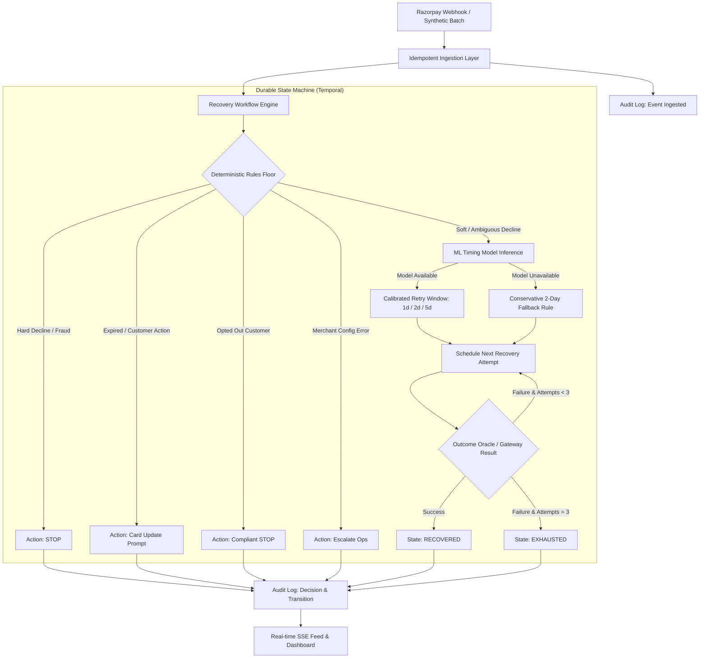

# Architecture & System Design: Triage (Involuntary Churn Recovery Orchestrator)

**Track:** Razorpay AI Buildathon — Track 03: AI Revenue Recovery  
**Product:** Triage (Decline-Aware Revenue Recovery Orchestrator)

---

## 1. System Overview

**Triage** is an event-driven, durable recovery system designed to sit between billing systems (or Razorpay subscription webhooks) and payment processing. Rather than issuing naive, fixed-interval retries that trigger issuer fraud penalties and churn subscribers, the system:
1. **Classifies the exact failure reason** according to Razorpay's decline taxonomy.
2. **Applies a deterministic rules safety floor** (hard fraud, card expiry, customer opt-outs, and merchant business configuration errors never enter blind retry loops).
3. **Applies a scoped ML timing model** to soft/ambiguous declines (`insufficient_funds`, `card_declined`) to align retries with pay-cycle windows and clearance curves.
4. **Executes durable, bounded recovery workflows via Temporal**, enforcing a maximum 3-attempt ceiling and queryable/signalable execution states.
5. **Maintains an append-only audit trail** explaining every decision, rule, and transition for compliance and merchant visibility.

---

## 2. Decision Engine & Safety Floor

Every recovery decision follows a strict precedence hierarchy:

1. **Customer Opt-Out Rule:** If a customer has unsubscribed or opted out of automated communications, all outreach and recovery attempts are terminated immediately (`action="stop"`, `decided_by="rule"`).
2. **Deterministic Rules Safety Floor:**
   - **Hard Risk Declines:** (`payment_risk_check_failed`, `card_lost`, `card_stolen`): Blind retries prohibited. Flagged as terminal `stop`.
   - **Customer Action Declines:** (`card_expired`, `international_transaction_not_allowed`, `authentication_failed`): Routed to email/customer prompt (`card_update_prompt`), bypassing automatic card charge.
   - **Business Configuration Errors:** (`payment_method_not_enabled`): Routed to internal operations queue (`escalate_ops`), strictly excluding customer dunning.
3. **Lightweight ML Timing Model:**
   - Scoped exclusively to ambiguous soft declines (`insufficient_funds`, `card_declined`).
   - Trained on historical pay-cycle patterns (proximity to 1st, 15th, and 30th of the month) and issuer decline resolution curves.
   - Output: Recommended delay (e.g. 5 days for pay-cycle clearance, 2 days for issuer holds, 1 day for transient gateway errors), model confidence, and natural-language feature attribution.
4. **Graceful Fallback:**
   - If the ML inference engine is disabled or throws an exception, the system automatically falls back to a conservative 2-day retry tagged with `decided_by="rule"`.

---

## 3. Durable Orchestration: Temporal State Machine

Each failed subscription is managed by a `RecoveryWorkflow` instance on Temporal:

- **Workflow ID:** `recovery-{subscription_id}-{policy}` guarantees end-to-end idempotency across webhook deliveries.
- **Max-Attempt Ceiling:** Workflow enforces `while self.attempt_count < 3`.
- **Queryable State:** Exposes `@workflow.query` returning `current_state` and `attempt_count` in real time without querying backend databases.
- **Dynamic Signals:** Exposes `@workflow.signal record_payment_result(succeeded: bool)` allowing out-of-band payment events (e.g. customer paid via payment link) to immediately transition active workflows to `recovered`.
- **Replay Resilience:** Worker restarts or infrastructure failovers resume workflow state directly from Temporal event history with zero duplicate charge executions.

---

## 4. API Specification

| Route | Method | Purpose |
| :--- | :--- | :--- |
| `/` | `GET` | Self-contained, real-time interactive dashboard UI (zero Node.js required) |
| `/webhooks/razorpay` | `POST` | Real Razorpay webhook receiver with HMAC-SHA256 signature verification |
| `/simulation/seed` | `POST` | Deterministic synthetic cohort generator (`{ seed, population_size }`) |
| `/simulation/run` | `POST` | Policy execution engine (`{ batch_id, policy: "naive" \| "orchestrator" }`) |
| `/batches/{id}/metrics` | `GET` | Comparative recovery rates, recovered revenue, and false-positive retries |
| `/batches/{id}/subscriptions` | `GET` | Cohort member list with decline categories and individual policy states |
| `/subscriptions/{id}/audit` | `GET` | Full append-only chronological lifecycle history for any subscription |
| `/events/stream` | `GET` | Server-Sent Events (SSE) live feed of state transitions |

---

## 5. Dual Runtime Modes

The system is designed for frictionless development and enterprise deployment:
1. **Local Mode (`ORCHESTRATION_MODE=local`):** Uses SQLite (`recovery_orchestrator.db`) and synchronous execution. Evaluators can run the entire test suite and CLI tool in seconds with pure Python.
2. **Distributed Mode (`ORCHESTRATION_MODE=temporal`):** Orchestrated via `docker-compose.yml` with FastAPI API, Temporal Worker, PostgreSQL 16, Redis 7, Temporal Server (port 7233), and Temporal Web UI (port 8088).
